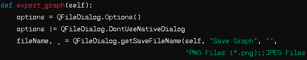
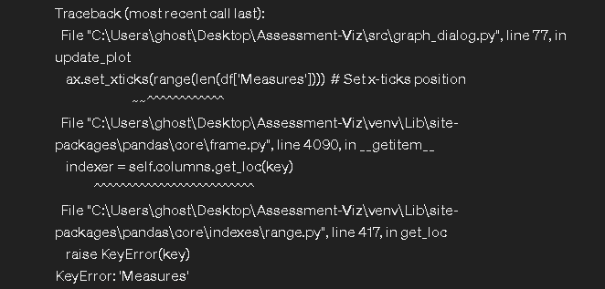
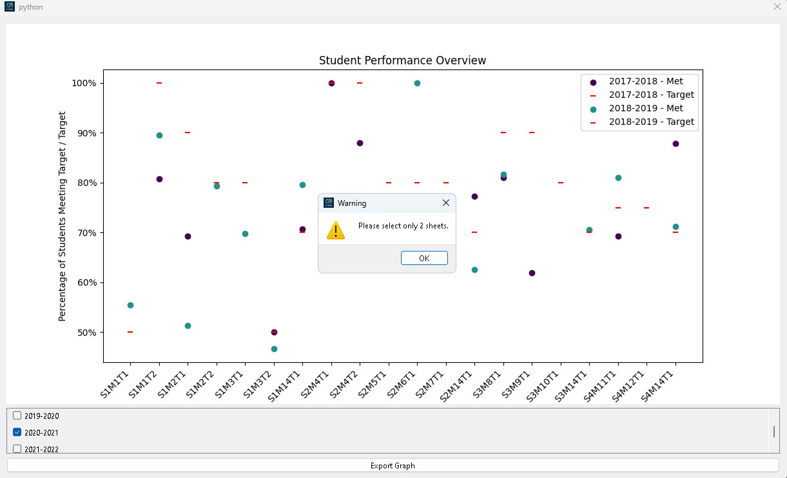

### Introduction

**Wisdom Waves** is an innovative data visualization tool designed to simplify the analysis and presentation of data extracted from Excel and CSV files. Targeted at users needing an intuitive way to view and interact with data spreadsheets, Wisdom Waves provides a robust environment for opening, reviewing, and graphing complex datasets with ease.

#### Project Overview

Upon launching Wisdom Waves, users are greeted with an interface where they can quickly load existing data files through a conveniently placed sidebar or directly from the 'Recent' menu. The application supports a variety of data formats, including the most commonly used Excel and CSV file types.

Once a file is loaded, the application offers a tabular view of the contents, allowing users to select individual sheets to visualize. Each sheet's data is presented in a clear and editable format on the Home Page, which serves as the central hub for data interaction. While direct editing of data is supported within the table view, it is important to note that these changes are not currently reflected when graphs are generated, as the graphing functionality captures the state of data at the time of file loading.

#### Graphing Capabilities

Wisdom Waves excels in its graphing capabilities, which are accessible via the 'Graph' menu. Users can launch a dedicated graphing window that allows for the comparison of up to two different data sheets simultaneously.

The application's graphing interface is designed to be interactive and user-friendly. Checkboxes allow for dynamic selection and deselection of data sheets for comparison. Graphs are automatically updated to reflect current selections, ensuring that users have up-to-date visual data representation at their fingertips. Special attention is given to datasets with varying target values, with distinct markers and colors used to differentiate between them effectively. If no sheets are selected, the graph display is cleared, allowing users to start a new selection without clutter or residue from previous data views.

#### Purpose of the Test Plan

This Test Plan Document outlines the strategies, methodologies, and resources allocated for the comprehensive testing of Wisdom Waves. The purpose of testing is to ensure that all functionalities, from file loading and data display to advanced graphing capabilities, operate efficiently and accurately under various conditions. The plan includes detailed test cases designed to cover most features, ensuring that Wisdom Waves meets its design specifications and is robust against potential errors or user challenges.

### Test Items

This section identifies the specific components and functionalities of the Wisdom Waves application that are subject to testing. Each of these test items has been selected based on their criticality to the application’s operation and user experience.

#### List of Test Items

1. **File Loading Functionality** :

* Ability to open and correctly parse data from Excel and CSV files.
* Error handling during the file loading process to ensure graceful failure in case of corrupt or unsupported file formats.

1. **User Interface** :

* Responsiveness and correctness of the UI, particularly the custom title bar, sidebar, and stacked widgets.
* Usability of the interface in facilitating user tasks like file navigation, data viewing, and accessing help resources.

1. **Data Display** :

* Accuracy and performance of displaying tabular data from loaded files.
* Functionality to switch between different data sheets within a single file.

1. **Graphing Capabilities** :

* Ability to graph data from selected sheets using predefined parameters.
* Handling of edge cases, such as empty sheets or data fields, without causing application crashes.

1. **Export Functionality** :

* Support for exporting generated graphs in various formats such as PNG, JPEG, and PDF.
* Correct application of file saving conventions and user feedback on success or failure of export operations.

1. **Application Stability** :

* Consistency and reliability of the application across different operating systems and hardware configurations.

#### Expected Functionality

Each component listed above is expected to operate smoothly, with all user interactions leading to predictable and correct outcomes. Specifically, file operations should be seamless, UI elements should be interactive without lag, and data manipulations should reflect accurately in outputs like tables and graphs.

### Approach

The testing approach for the Wisdom Waves application is designed to comprehensively evaluate the application's functionality, usability, and reliability. This section outlines the methods and techniques that will be employed to ensure that each feature meets its intended specifications and provides a high-quality user experience.

#### Testing Methodology

1. **Manual Testing** :

* **Interactive Use** : Testers will manually interact with the application to simulate typical user activities. This includes opening files, navigating through the application, using graphing features, and utilizing help resources.
* **Interface Testing** : Testers will verify that all UI components, such as buttons, dialogs, and menus, function as expected and are user-friendly.

1. **Functional Testing** :

* **Feature Verification** : Each core functionality, such as file opening, data display, and graph generation, will be tested to ensure it operates according to the requirements.
* **Error Handling** : Testers will input erroneous data or perform unsupported operations to ensure the application handles these gracefully without crashing.

1. **Regression Testing** :

* After any fixes or updates, regression tests will be conducted to ensure that previously working functionalities have not been broken by the new changes.

#### Testing Techniques

* **Boundary Value Analysis** :
* This technique will be applied, especially in graphing functionalities, where limits (like a maximum of two checkboxes) are set. Testers will check these boundaries to ensure they are enforced correctly.
* **Equivalence Partitioning** :
* Input data for testing will be divided into equivalent groups (such as different file types and graphable vs. non-graphable data) to reduce the total number of test cases while covering all scenarios.

#### Tools and Resources

* **Test Environment** :
* The application will be tested on both Windows and macOS to ensure cross-platform compatibility.
* Different versions of Excel and CSV files will be used to simulate real-world use cases.
* **Documentation** :
* Test cases will be documented, including expected outcomes and actual results.
* Screenshots and error logs will be captured for each test case to provide visual proof and detailed insights into any issues encountered.

#### Feedback and Iteration

* **Continuous Improvement** :
* Feedback from testing will be systematically recorded and reviewed with the development team.
* Adjustments and enhancements will be prioritized based on the severity and impact of the issues found.
* **Stakeholder Updates** :
* Regular updates will be provided to stakeholders to keep them informed about the testing progress and any significant findings.

### Test Cases

#### Test Case 1: Help/Home in Starter Page

* **Objective** : To verify that the Help and Home buttons on the Starter Page function as intended.
* **Steps to Execute** :

1. Launch the application to open the Starter Page.
2. Click the 'Help' button.
3. Observe the information displayed.
4. Return to the Starter Page and click the 'Home' button.

* **Expected Results** :
* Clicking 'Help' should display the help widget with guiding text.
* Clicking 'Home' should bring forth the Home widget, resetting the view to the main screen.
* **Pass Criteria** : The correct widget displays upon clicking each button without errors.
* **Failures Noted** :
* Initially, 'Help' displayed a blank screen due to incorrect widget initialization.
* 'Home' button failed to reset to the main screen due to stacking issues.
* **Resolution** :
* Ensured proper initialization and calling of stacked widgets.

#### Test Case 2: Open File Functionality

* **Objective** : To ensure the application can open both Excel and CSV files properly.
* **Steps to Execute** :

1. Click the 'Open' button to launch the file explorer.
2. Select an Excel file and open it.
3. Repeat the process with a CSV file.

* **Expected Results** :
* Both Excel and CSV files should load successfully with data correctly formatted.
* **Pass Criteria** : Files open without errors and data displays correctly.
* **Failures Noted** :
* Excel files were loaded but data was incorrectly formatted.
* **Resolution** :
* Converted all files to CSV for uniformity and correct formatting.

#### Test Case 3: Tabular View

* **Objective** : To confirm the tabular view displays multiple sheets from a file correctly.
* **Steps to Execute** :

1. Open a file containing multiple sheets.
2. Navigate through different sheets within the tabular view.

* **Expected Results** :
* Each sheet's data should display correctly in a tabular format.
* **Pass Criteria** : All sheets are accessible and data is correctly displayed in tabs.
* **Failures Noted** : None.

#### Test Case 4: Graphing Data from Files

* **Objective** : To test the graphing functionality, particularly with empty sheets.
* **Steps to Execute** :

1. Load a file with at least one empty sheet.
2. Attempt to graph the empty sheet.

* **Expected Results** :
* The application should not crash and should notify the user that no data is available to graph.
* **Pass Criteria** : Handles empty sheets gracefully without crashing.
* **Failures Noted** :
* Initial attempts to graph an empty sheet caused the application to crash.
* **Resolution** :
* Implemented checks for data presence before graphing and handled exceptions appropriately.

#### Test Case 5: Selecting Check Boxes for Graphing

* **Objective** : To ensure that no more than two checkboxes can be selected for graphing.
* **Steps to Execute** :

1. Attempt to select three checkboxes in the graphing interface.

* **Expected Results** :
* The third checkbox should not remain selected, and a warning should be displayed.
* **Pass Criteria** : Only two checkboxes can be selected at any time.
* **Failures Noted** :
* Users were able to select more than two checkboxes; third checkbox did not uncheck automatically.
* **Resolution** :
* Refined the logic to enforce a maximum of two selections and improved the response when this limit is exceeded.

### Testing Schedule

The testing of the Wisdom Waves application is integrated into the overall development lifecycle, ensuring that each phase of the application development is accompanied by rigorous testing. This integrated approach helps in identifying and resolving issues early in the development process, enhancing the overall quality of the application.

#### Testing Phases

* **Continuous Testing During Development** :
* As new features and functionalities were developed, they were immediately subjected to testing to validate their correctness and to ensure that they did not introduce regressions or new bugs into the system.
* This phase involved daily testing sessions as new code was committed, using both automated and manual testing strategies.
* **Final Testing Before Publication** :
* Prior to the final release of the project, a comprehensive testing phase was initiated to ensure all components of the application worked harmoniously.
* This phase focused on regression, usability, and performance testing to validate the application’s readiness for release.

#### Timeline

* Testing has been conducted throughout the project's development lifecycle, with additional intensive testing sessions scheduled during the two weeks leading up to the project's final release.
  * Started February 2024 - Ended May 2024.
* Final testing phases were conducted with the participation of all project team members and selected end-users to ensure a wide range of use cases were covered.
  * Done on 05/01/2024 (10:00AM-12:30Noon through 3:00PM -> 05/02/2024 5:00AM)

#### Test Team

* The test team consisted of mainly the Lead Developer, but also group members.
* Feedback from these sessions was used to make final adjustments before release, ensuring that the application met all user expectations and technical requirements.

### Conclusion

The testing strategy for Wisdom Waves was designed to be comprehensive, ensuring that every component of the application was tested under various conditions and met the high standards set by the development team. This thorough testing not only enhanced the quality of the final product but also ensured a smooth user experience upon release.

### Test Deliverables

The test deliverables for the Wisdom Waves project include detailed
documentation of all test cases, their execution status, and outcomes.
These deliverables are essential for maintaining transparency and for
future reference should any issues arise post-deployment.

#### List of Test Deliverables

- **Test Plan** : The document itself which outlines testing strategy, test cases, expected outcomes, and actual results.

* **Test Case Execution Report** : This report includes detailed outcomes for each test case, specifying whether the test passed or failed and any deviations from expected results.
* **Error Logs and Output Messages** : Documentation of any errors or issues encountered during testing, along with relevant output messages that helped identify or diagnose these issues.
* **Project Plan** : Documentation developed by the team as whole in which lead the way for developing this application.
* **Requirements Document** : Documnetation developed by the team based off meeting with the customer. Used to closely strucutre our approach, functional, and non-functional aspects of this project.

#### Documentation of Errors and Output Messages

**Error While Exporting Graph as PDF** : "AttributeError: type object 'QFileDialog' has no attribute 'Options'"

* This is from incorrect implementation of a built in function from PyQt6.GUI (Image is code snippet of incorrect Implementation)
* 

**Graph Export File Format Issues** : "Failed to save graph as PDF on desktop"

- This error was found by testing all forms of exporting. PDF would not appear when saved to Desktop. (Image not available for this test)

**Application Crash on Graphing Empty Sheets** : "Exception: attempt to plot graph with empty dataset" (Image is of error message in terminal could not get image of program due to crashing)

- This error was due to poor exception handling. Program searched automatically for column names to graph instead of checking for empty first.
  

**Multiple Checkboxes Selection Beyond Limit** : Warning: Please select only two sheets

- This warning was generated by checking if number of check boxes marked exceeds the maximum number of allowed marks. (Image provided)
- 

### Approval

The completion and validation of this Test Plan Document signify that the Wisdom Waves application has been thoroughly tested according to the standards and procedures outlined in this document. The lead developer is responsible for the final review and approval of the testing procedures and outcomes.

#### Sign-off

To ensure accountability and the integrity of the testing process, the lead developer will sign off on this document, confirming that all tests have been executed as described, and that the test results meet the acceptance criteria established for the project.

Name: David Reyes-Coy

Signature:

Date: 05/02/2024
The approval by the lead developer confirms that the Wisdom Waves application is ready for final release (submission to the customer).
